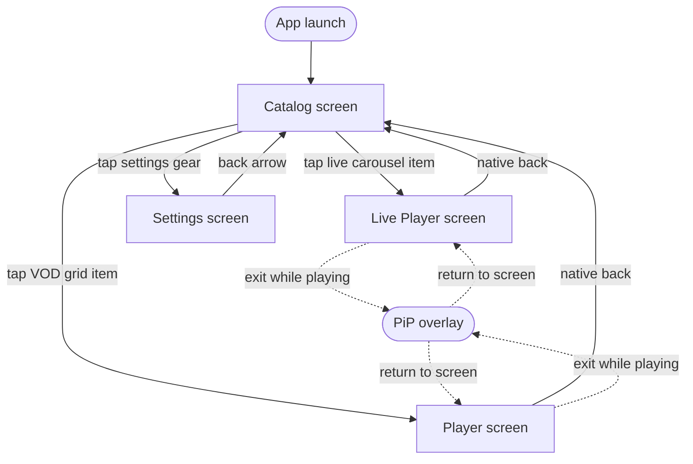

# navigation.md — StreamKit

**Version:** 0.1.3
**Status:** Draft
**Owner:** Danielle Mariani
**Created at:** 2026-06-25
**Last Updated:** 2026-06-26
**Location:** specs/design/navigation.md

---

## Overview

This document defines the screen-level navigation flows for StreamKit's `app` (mobile) module, with notes on how the `tv` (Fire TV) module mirrors or diverges from each flow. It covers navigation structure, screen-entry behavior, route naming, and in-screen interaction affordances — not visual design (typography, spacing, color), which belongs in `specs/design/design.md`.

---

## Global Navigation Patterns

These patterns apply across all screens unless a screen-level note overrides them.

### Content-Type-Driven Playback Start

StreamKit's equivalent of a "detail screen vs. direct edit" split is driven by content type, not entity type:

| Content type | Tap behavior | Playback start |
|---|---|---|
| VOD | Opens Player screen, shows poster + metadata first | User taps Play explicitly (`BR-CAT-02`) |
| Live | Opens Live Player screen | Begins automatically, no tap required (new rule — see `CONTEXT.md`) |

**Rationale:** a VOD asset has a meaningful "not yet started" state worth showing detail for. A live stream doesn't — there's no fixed start point to preview, so autoplay is the more honest representation of what the user is tapping into.

### Sub-Screen Navigation

Player, Live Player, and Settings are all full-screen destinations (no bottom nav or shell chrome exists in this app to hide, since Catalog has none either).

- **Player and Live Player intentionally omit any back arrow or top bar.** This is a deliberate departure from a typical "feature-owned top bar with back arrow" pattern, justified by the immersive nature of a video player — native back gesture/button is the only way back to Catalog (see screen sections below for the maximize-state nuance).
- **Settings uses a standard top bar** — back arrow (left) + "Settings" title — since it's a utility screen, not an immersive one.

### Empty States

| Layer | Scenario | Treatment |
|---|---|---|
| Dependency not met | No Mux test assets uploaded yet (`content-catalog.md` open item) | VOD grid shows an empty-state message guiding toward Mux setup, rather than a blank grid |
| No data yet | Mux configured but the catalog fetch returns zero items, or all 3 live sources fail to resolve | Section-level empty state per row (Live carousel and VOD grid can be empty independently) |

> Network/connectivity error states (Mux unreachable, etc.) are a related but distinct concern — worth a note in `design.md` rather than fully speccing here.

---

## App Launch Logic

```
App Launch
    │
    └──► Catalog Screen (sole start destination — no onboarding, no auth, no launch flags)
              │
              └──► Catalog reads from Room cache (renders immediately if present)
                        └──► Refreshes from Mux API in the background, updates in place
```

There is no onboarding flow and no authentication anywhere in StreamKit (per `SPEC.md`'s User Roles section — single-user, no login). Catalog is always the first screen shown.

---

## Navigation Graph

```
Catalog (start destination, portrait-locked)
├── tap Live carousel item  → Live Player Screen
├── tap VOD grid item       → Player Screen
└── tap Settings (gear)     → Settings Screen

Player Screen        → native back → Catalog
Live Player Screen   → native back → Catalog
Settings Screen       → back arrow → Catalog
```

- **PiP** is not a navigation destination — it's a window-mode transition from Player/Live Player screens (per `ARCHITECTURE.md`).
- **Cast** is not a navigation destination — it's an in-screen device picker overlay from Player/Live Player screens.
- Deep links into either player screen pass `video_id` only, never a full `Video` object (per `ARCHITECTURE.md`'s existing navigation rule).

---

## Screen Inventory

| Screen | Route | Entry point | Description |
|---|---|---|---|
| Catalog | `catalog` | App launch (start destination) | Live carousel + VOD grid, portrait-only |
| Live Player | `live_player/{video_id}` | Tap Live carousel item | Autoplay, DVR controls, maximize/minimize, PiP, Cast |
| Player | `player/{video_id}` | Tap VOD grid item | Tap-to-play detail + playback, 10s seek both directions, long-press 1.5x, maximize/minimize, PiP, Cast |
| Settings | `settings` | Tap gear icon on Catalog | Environment picker, metadata diagnostic toggles |

---

## Screens

### 1. Catalog Screen

- Single scrollable screen, **portrait-only** (orientation locked).
- Top bar: app name (left), Settings gear icon (right).
- **Section 1 — Live:** horizontal carousel, 3 items, pager dots indicating the active item (others dimmed). Each card shows the poster image with a bottom-left overlapping label (live stream name) — no other text. Tapping a card opens the **Live Player Screen**.
- **Section 2 — Videos (VOD):** 2-column grid, poster image + title label per item. Tapping an item opens the **Player Screen**.

> **Open item:** Red Bull TV plus two newly proposed candidates (DW English, NHK World-Japan) now fill the 3-item carousel — see `content-catalog.md` Live Sources 1–3. All three remain unverified pending manual playback testing, and the two new candidates are also pending Dani's confirmation.

---

### 2. Live Player Screen

- Entered via Catalog tap. Playback **autoplays immediately** — no tap-to-play step. This is a deliberate, content-type-specific exception (see Global Navigation Patterns above).
- **Default state:** portrait, video pinned to the top of the screen, metadata (video name, and other properties TBD) scrollable below.
- **Controls overlay:** Play/Pause, Live button (bottom-left, visible only when behind the live edge per `BR-LIV-01`), progress bar, maximize/minimize toggle (bottom-right), Cast icon (top-right, visible only when a Chromecast device is available per `BR-CST-01`).
- An invisible, full-height double-tap zone on the left edge (not overlapping the Live button) triggers the same 10-second-back action as the visible control.
- No forward-seek control — seeking past the live edge isn't meaningful for live content.
- **Maximize/minimize:** controlled by both the toggle button and physical device rotation (either one drives the same state).
  - **Landscape (maximized):** video fills the entire screen, fullscreen, not scrollable, no metadata shown.
  - **Portrait (minimized):** video pinned to top at full width, metadata visible and scrollable below.
- No back button in the screen UI — native back gesture/button only.
  - **Confirmed:** if currently maximized, back press exits fullscreen to portrait first, staying on this screen; a second back press returns to Catalog. This matches the convention used by most video streaming apps (YouTube, Netflix, Hulu).
- **PiP:** auto-triggers on navigating away **only if actively playing** — exiting while paused does not trigger PiP. Returning to the screen dismisses PiP and resumes inline without interruption.
- **Cast:** tapping opens the available-device picker.

---

### 3. Player Screen (VOD)

- Entered via Catalog tap. Shows detail (poster, metadata) first — playback does not begin until the user explicitly taps Play. This satisfies `BR-CAT-02`, now scoped specifically to VOD.
- Same maximize/minimize, PiP, and Cast behavior as the Live Player Screen (including the toggle + sensor rotation, and the confirmed back-button convention above).
- **Controls:** centered seek-back-10s / Play-Pause / seek-forward-10s, with invisible double-tap zones on both the left and right edges mirroring the visible controls, plus a progress bar.
- **Long-press** on the video surface temporarily sets playback speed to 1.5x; releasing reverts to 1x.
- No back button in screen UI — same native-back convention as the Live Player Screen.

---

### 4. Settings Screen

- Standard top bar: back arrow (left) + "Settings" title.
- **Server/environment picker** (Mux / Local) — `Local` is inert until Phase 4's backend exists, but the control can be built now per `ARCHITECTURE.md`'s existing environment-switching design.
- **Metadata diagnostic toggles** (Phase 1 scope):
  - Bitrate / resolution / buffer health overlay (the underlying overlay is always computed per `BR-PLY-03`; this toggle controls whether it's *displayed* — **default: on**)
  - Bytes downloaded (per-segment and session cumulative)
  - Network type & estimated bandwidth
  - Dropped frames count
  - Manifest/protocol + codec info (HLS vs DASH, current rendition codec)
- **Deferred:** startup time / time-to-first-frame — better suited as a one-time session stat surfaced in the Phase 6 telemetry dashboard than a live overlay toggle.

---

## Fire TV (`tv` module) Notes

Mirrors Catalog → Player / Live Player. No Settings destination, consistent with `ARCHITECTURE.md`'s existing TV destination table — environment switching is a mobile-only concern, and Fire TV inherits whatever environment was last configured on the phone. Maximize/minimize and PiP are mobile-only concepts; Fire TV is always presented in its lean-back, full-screen 10-foot UI and has no PiP support. Cast is not applicable in the sense described here, since Fire TV is itself a cast *target*, not a casting client.

---

## Navigation Diagram



---

## Open Questions

| # | Question | Status |
|---|---|---|
| 1 | ~~Two additional live stream URLs needed to populate the 3-item carousel~~ | **Candidates proposed** — DW English and NHK World-Japan, see `content-catalog.md` Live Sources 2–3. Pending Dani's confirmation and manual playback verification (same as Red Bull TV) |
| 2 | ~~Confirm back-button-while-maximized assumption~~ | **Resolved** — back exits fullscreen to portrait first, staying on the same screen; second back exits to Catalog |
| 3 | ~~Should the bitrate/resolution/buffer overlay default to on or off?~~ | **Resolved** — default on |

> Required updates to `SPEC.md` and `ARCHITECTURE.md` triggered by this document are tracked in `CONTEXT.md`, not duplicated here.

---

## Changelog

| Version | Date | Author | Notes |
|---|---|---|---|
| 0.1.0 | 2026-06-25 | Danielle Mariani | Initial draft — navigation structure, global patterns, launch logic, screen inventory, and Mermaid diagram for Catalog, Live Player, Player, and Settings screens |
| 0.1.1 | 2026-06-25 | Danielle Mariani | Removed "Not Applicable to This Project" section; resolved back-button-while-maximized behavior (exits fullscreen first, stays on screen) and bitrate/resolution/buffer overlay default (off) |
| 0.1.2 | 2026-06-26 | Danielle Mariani | Flipped the bitrate/resolution/buffer overlay default from off to on, matching the corresponding `SPEC.md` BR-PLY-03 update |
| 0.1.3 | 2026-06-26 | Danielle Mariani | Updated the Catalog screen's open item and Open Question #1 to reflect two newly proposed (unverified, unconfirmed) live source candidates — see `content-catalog.md` Live Sources 2–3 |

---

## Related Documents

| Document | Purpose |
|---|---|
| SPEC.md | Business rules referenced throughout |
| ARCHITECTURE.md | Nav graph destinations, module structure |
| specs/design/design.md | Visual design guidelines (to follow) |
| specs/technical/data-model.md | `Video` entity schema |
| specs/technical/content-catalog.md | Live/VOD content sources |
| CONTEXT.md | Tracks required follow-up updates to SPEC.md / ARCHITECTURE.md triggered by this document |